# BrainBench Dashboard Index

<!-- brainbench:generated:visual-snapshot:start -->

## Operating Snapshot

| Area | Status | Signal |
|---|---|---|
| Active Sprint | 5 / 7 complete | On track |
| Field Trial | 3 / 3 complete | Closed |
| Open PR Reviews | 0 | Clear |
| Evidence Gaps | 1 | Attention |
| Decision Gaps | 0 | Clear |
| Needs Human Review | 1 | Review issue-12 |

<!-- brainbench:generated:visual-snapshot:end -->

<!-- brainbench:generated:visual-sdlc-flow:start -->

## SDLC Pipeline

```mermaid
flowchart LR
  A["Intake: 0"] --> B["Triage: 2"]
  B --> C["In Progress: 1"]
  C --> D["PR Review: 0"]
  D --> E["Evidence Gaps: 1"]
  E --> F["Decision Gaps: 0"]
  F --> G["Done: 5"]

  A:::active
  B:::active
  C:::active
  D:::clear
  E:::warning
  F:::clear
  G:::done

  classDef active fill:#f5f5f5,stroke:#555,stroke-width:1px;
  classDef clear fill:#eef7ee,stroke:#555,stroke-width:1px;
  classDef warning fill:#fff3cd,stroke:#555,stroke-width:1px;
  classDef done fill:#e8f0fe,stroke:#555,stroke-width:1px;
```

<!-- brainbench:generated:visual-sdlc-flow:end -->

<!-- brainbench:generated:visual-quality-gates:start -->

## Quality Gates

| Gate | Open | Status | Action |
|---|---:|---|---|
| PR Review | 0 | Clear | None |
| Evidence Gaps | 1 | Attention | Link required PR numbers to tasks |
| Decision Gaps | 0 | Clear | None |
| Human Review | 1 | Attention | Review issue-12 |

<!-- brainbench:generated:visual-quality-gates:end -->

<!-- brainbench:generated:visual-system-health:start -->

## System Health

| System | State | Current Focus | Risk | Evidence |
|---|---|---|---|---|
| **BrainBench** | Active | Dashboard clarity | Low | Complete |
| **DAX** | Active | Verification harness | Low | Complete |
| **Rook** | Active | Verification harness | Low | Complete |
| **Soothsayer** | Paused | Governance catalog | Clear | Complete |
| **Flowright** | Paused | Product-fit map | Clear | Complete |
| **ToolSmith** | Paused | Utility roadmap | Clear | Complete |
| **Tessera** | Paused | Repo-to-use-case | Clear | Complete |
| **Picobot** | Unmapped | Ingress bridge | Clear | Complete |
| **PruningMyPothos** | Unmapped | Documentation surface | Clear | Complete |

<!-- brainbench:generated:visual-system-health:end -->

<!-- brainbench:generated:visual-human-review:start -->

## Needs Human Review

| Item | Reason | Suggested Action |
|---|---|---|
| issue-12 | Backlog item still pending review | Confirm owner / close / move to next sprint |

<!-- brainbench:generated:visual-human-review:end -->

<!-- brainbench:generated:visual-agent-advisory:start -->

## Agent Advisory

| Signal | Source | Confidence | Action |
|---|---|---|---|
| 1 evidence gaps found | Evidence Agent | High | Link PRs to backlog tasks |
| No open decision gaps | Decision Gap Agent | High | None |
| Sprint state updated | PR Review Agent | Medium | Review if unexpected |

<!-- brainbench:generated:visual-agent-advisory:end -->

## Human Notes
[Add manual notes here. These will be preserved by refresh script.]
