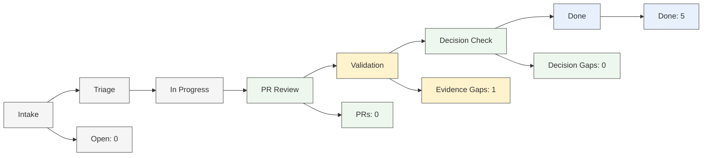

# BrainBench Dashboard Index

<!-- brainbench:generated:visual-snapshot:start -->

## Operating Snapshot

| Signal | Value | Status |
|---|---:|---|
| Active Systems | 3 | Running |
| Active Sprint Progress | 5 / 7 | In Progress |
| Field Trial Progress | 3 / 3 | Complete |
| Open Evidence Gaps | 1 | Attention |
| Open Decision Gaps | 0 | Clear |
| Human Review Items | 1 | Attention |

<!-- brainbench:generated:visual-snapshot:end -->

<!-- brainbench:generated:visual-sdlc-flow:start -->

## Visual SDLC Pipeline



<!-- brainbench:generated:visual-sdlc-flow:end -->

<!-- brainbench:generated:visual-quality-gates:start -->

## Quality Gates

| Gate | Open | Status | Action |
|---|---:|---|---|
| PR Review | 0 | Clear | None |
| Evidence Gaps | 1 | Attention | Link required PR numbers to tasks |
| Decision Gaps | 0 | Clear | None |
| Human Review | 1 | Attention | Review issue-12 |

<!-- brainbench:generated:visual-quality-gates:end -->

<!-- brainbench:generated:visual-system-health:start -->

## System Health

| System | State | Current Focus | Risk | Evidence |
|---|---|---|---|---|
| **BrainBench** | Active | Dashboard clarity | Low | Complete |
| **DAX** | Active | Verification harness | Low | Complete |
| **Rook** | Active | Verification harness | Low | Complete |
| **Soothsayer** | Paused | Governance catalog | Clear | Complete |
| **Flowright** | Paused | Product-fit map | Clear | Complete |
| **ToolSmith** | Paused | Utility roadmap | Clear | Complete |
| **Tessera** | Paused | Repo-to-use-case | Clear | Complete |
| **Picobot** | Unmapped | Ingress bridge | Clear | Complete |
| **PruningMyPothos** | Unmapped | Documentation surface | Clear | Complete |

<!-- brainbench:generated:visual-system-health:end -->

<!-- brainbench:generated:visual-human-review:start -->

## Needs Human Review

| Item | Reason | Suggested Action |
|---|---|---|
| issue-12 | Backlog item still pending review | Confirm owner / close / move to next sprint |

<!-- brainbench:generated:visual-human-review:end -->

<!-- brainbench:generated:visual-agent-advisory:start -->

## Agent Advisory Signals

| Agent | Repo/System | Signal | Confidence | Operator Action |
|---|---|---|---|---|
| Triage Agent | toolsmith | Default low priority assignment. Warning: has unassigned owner, unassigned priority. | `low` | Review roadmap boundary |
| Triage Agent | rook | Touches active core SDLC verification system: rook. | `high` | Review triage suggestions |
| Evidence Agent | rook | Work item is in status `ready-for-review` but has no mapped PR number in its frontmatter. | High | Link PRs to backlog tasks |
| Decision Gap Agent | BrainBench | No open decision gaps | High | No action |
| Weekly Brief | Sprint | 5 / 7 complete | High | Review #12 |

<!-- brainbench:generated:visual-agent-advisory:end -->

<!-- brainbench:generated:repo-insight-matrix:start -->

## Repo / System Insight Matrix

| Repo/System | Work State | Risk | Evidence | Decision | Advisory Signal | Next Action |
|---|---|---|---|---|---|---|
| **BrainBench** | No active work | Low | Complete | Clear | Dashboard clarity trial active | Operate from cockpit |
| **DAX** | No active work | Low | Complete | Clear | Verification harness active | Run local validation:

```bash
bun run typecheck:dax
bun run test
dax sdlc verify --format json
dax sdlc verify --native --format json --receipts
``` |
| **Rook** (Issue #12) | Review | Medium | Unknown | Clear | Needs human review | Confirm close / carry forward |
| **Soothsayer** | No active work | Low | Complete | Clear | No active implementation. | Do not modify until the DAX/Rook SDLC verification slice stabilizes. |
| **Flowright** | Done | Low | Complete | Clear | Wait for DAX/Rook SDLC core verification loops to stabilize before wiring kernel orchestration. | Review product positioning |
| **ToolSmith** | Done | Low | Complete | Clear | Support repo visibility, token cost calculations, rule generation, and context packing. | Decide next utility category |
| **Tessera** | Done | Low | Complete | Clear | Establish a catalog of reusable agent step templates and data conversion rules. | Candidate for next build slice |
| **Picobot** | No active work | Low | Complete | Clear | Confirm the exact repository name and owner. | Map the repository in `ecosystem.yml` once confirmed. |
| **PruningMyPothos** | No active work | Low | Complete | Clear | Confirm the exact repository name and owner. | Map the repository in `ecosystem.yml` once confirmed. |

<!-- brainbench:generated:repo-insight-matrix:end -->

<!-- brainbench:generated:repo-action-lanes:start -->

## Repo Action Lanes

### BrainBench

| Signal | Status | Action |
|---|---|---|
| Objective: Establish V2 structure containing Brain, Bench, Control, Dashboard, Memory, State, and Systems. | Active | Complete Phase 1 refactor verification and publish dogfooding logs. |
| Freshness | Unknown | No action |
| Evidence | Complete | No action |
| Decision gaps | Clear | No action |

### DAX

| Signal | Status | Action |
|---|---|---|
| Objective: Add the first SDLC verification harness that treats tests, CI checks, and command outputs as structured evidence. | Active | Run local validation:

```bash
bun run typecheck:dax
bun run test
dax sdlc verify --format json
dax sdlc verify --native --format json --receipts
``` |
| Freshness | Unknown | No action |
| Evidence | Complete | No action |
| Decision gaps | Clear | No action |

### Rook

| Signal | Status | Action |
|---|---|---|
| Add Rook verify command (Refined) | Review | Confirm close / move to next sprint |
| Freshness | Unknown | No action |
| Evidence | Complete | No action |
| Decision gaps | Clear | No action |

### Soothsayer

| Signal | Status | Action |
|---|---|---|
| Objective: No active implementation. | Paused | Do not modify until the DAX/Rook SDLC verification slice stabilizes. |
| Freshness | Unknown | No action |
| Evidence | Complete | No action |
| Decision gaps | Clear | No action |

### Flowright

| Signal | Status | Action |
|---|---|---|
| [Flowright] Define use-case and product-fit map | Complete | Review product-fit assumptions |
| Freshness | Unknown | No action |
| Evidence | Complete | No action |
| Decision gaps | Clear | No action |

### ToolSmith

| Signal | Status | Action |
|---|---|---|
| [ToolSmith] Define utility roadmap and repo-helper scope | Complete | Select first repo-helper utility |
| Freshness | Unknown | No action |
| Evidence | Complete | No action |
| Decision gaps | Clear | No action |

### Tessera

| Signal | Status | Action |
|---|---|---|
| [Tessera] Define repo-to-use-case utility | Complete | Convert into build issue |
| Freshness | Unknown | No action |
| Evidence | Complete | No action |
| Decision gaps | Clear | No action |

### Picobot

| Signal | Status | Action |
|---|---|---|
| Objective: Confirm the exact repository name and owner. | Unmapped | Map the repository in `ecosystem.yml` once confirmed. |
| Freshness | Unknown | No action |
| Evidence | Complete | No action |
| Decision gaps | Clear | No action |

### PruningMyPothos

| Signal | Status | Action |
|---|---|---|
| Objective: Confirm the exact repository name and owner. | Unmapped | Map the repository in `ecosystem.yml` once confirmed. |
| Freshness | Unknown | No action |
| Evidence | Complete | No action |
| Decision gaps | Clear | No action |

<!-- brainbench:generated:repo-action-lanes:end -->

<!-- brainbench:generated:quality-gates-by-repo:start -->

## Quality Gates by Repo

| Repo/System | PR Review | Evidence | Decision Gap | Human Review | Overall |
|---|---|---|---|---|---|
| **BrainBench** | Clear | Clear | Clear | None | Healthy |
| **DAX** | Clear | Clear | Clear | None | Healthy |
| **Rook** | Clear | Attention | Clear | Watch | Attention |
| **Soothsayer** | Clear | Clear | Clear | None | Healthy |
| **Flowright** | Complete | Complete | Clear | None | Healthy |
| **ToolSmith** | Complete | Complete | Clear | None | Healthy |
| **Tessera** | Complete | Complete | Clear | None | Healthy |
| **Picobot** | Clear | Clear | Clear | None | Healthy |
| **PruningMyPothos** | Clear | Clear | Clear | None | Healthy |

<!-- brainbench:generated:quality-gates-by-repo:end -->

<!-- brainbench:generated:repo-recommended-actions:start -->

## Recommended Actions

### BrainBench

- Continue dashboard clarity trial from `dashboard/index.md`.
- Avoid new architecture changes until one normal sprint completes.

### DAX

- No action needed. System is stable.

### Rook

- Verify validation logs for pending review tasks.
- Confirm owner, close, or move to next sprint.

### Soothsayer

- No action needed. System is stable.

### Flowright

- Review use-case map for product-fit clarity.
- Identify top 3 use cases worth building into examples.

### ToolSmith

- Select first repo-helper utility.
- Keep internal BrainBench scripts separate from future product utilities.

### Tessera

- Convert repo-to-use-case concept into a scoped build task.
- Define input/output schema before implementation.

### Picobot

- No action needed. System is stable.

### PruningMyPothos

- No action needed. System is stable.

<!-- brainbench:generated:repo-recommended-actions:end -->

## Operator Notes

<!-- brainbench:manual:operator-notes:start -->

Use this section for human observations during dashboard clarity trials.

<!-- brainbench:manual:operator-notes:end -->

## Human Notes
[Add manual notes here. These will be preserved by refresh script.]
